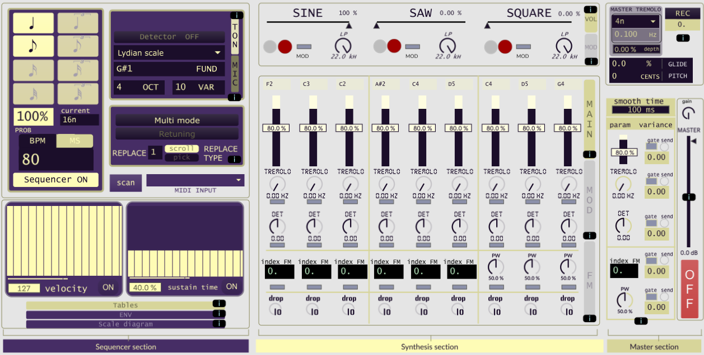

# Coreeno
Un software per la generazione e la sintesi di strutture sonore costruito in Max/MSP (Cycling '74), sviluppato come progetti di tesi per la laurea triennale in Musica Elettronica al conservatorio.

## Italiano
Coreeno ha un sistema di generazione di frequenze progettato in modo tale da produrre dei suoni di sintesi additiva. Lo strumento integra un sequencer con un comportamento differente rispetto a un utilizzo tradizionale: le note vengono assegnate con particolari criteri ai nove oscillatori presenti, basandosi su parametri melodici, armonici e ritmici.  
Questo meccanismo di generazione e sintesi rappresenta il concetto principale di Coreeno, ma lo strumento integra varie funzionalità e meccanismi tipici dei classici sintetizzatori (modulazioni, inviluppo, ecc.) e accorgimenti specifici (vari tipi di oscillatori, FM, ecc.).

### Screenshot

### Video dimostrativo per l'utilizzo

### Esempi di frammenti musicali

### Come aprire la patch
1. Necessario avere Max installato: disponibile su [cycling74.com](https://cycling74.com).
2. Scaricare Coreeno_v0.05.zip
3. Aprire "Coreeno_v0.05.maxproj". Potrebbe essere necessario avviare prima Max e importarlo da File -> Open...
4. Premere il tasto rosso di accensione sulla destra dello schermo, nella master section, inizialmente impostato su "OFF"

### Tesi
Il documento completo della tesi è disponibile qui:  
[Download tesi PDF](thesis/Tesi_Sintetizzatore.pdf)

### Cosa farei di diverso, oggi, per un progetto del genere
-meno cose e più curate
-più modularità ed estendibilità
-non farei un progetto così ampio e "general purpose". La programmazione in Max è di alto livello per un programmatore ma di basso per un musicista. Va utilizzato con progetti più circoscritti, magari anche più complessi di questa patch ma con uno scopo più preciso. Come sempre, nell'informatica è inutile reinventare la ruota e si farebbe meglio a guardarsi attorno prima di fare le cose da soli

### Perché Max è stato importante per me
-anche se l'utilizzo che ne ho fatto non è stato ottimale, ho potuto scontrarmi con molti problemi e imparare tante cose. Nonostante l'ingenuità progettuale, il software risulta interessante e valido
-mi ha fatto scoprire veramente la passione per la programmazione
-mi ha offerto uno spazio creativo dove sperimentare e realizzare le mie idee

---

## English

